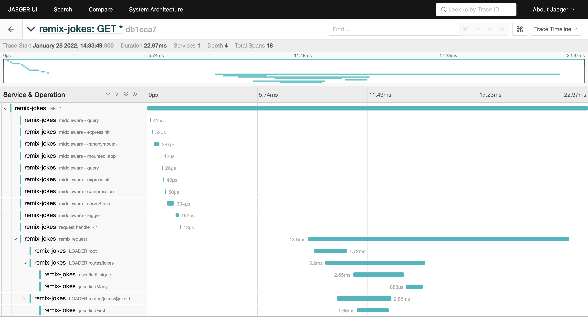
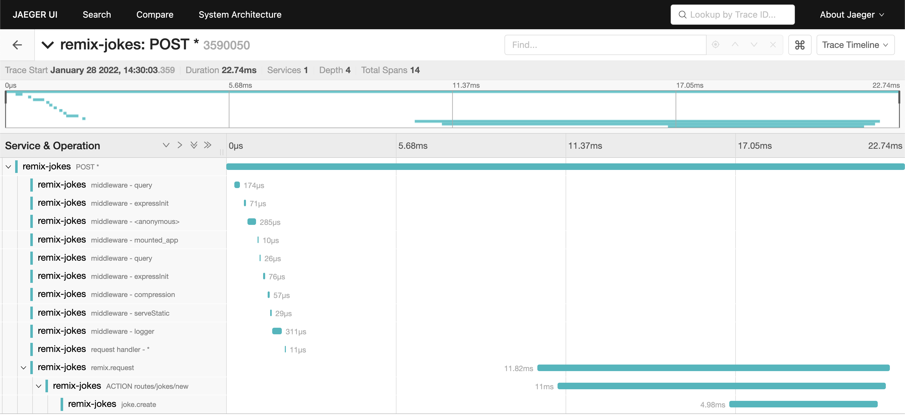
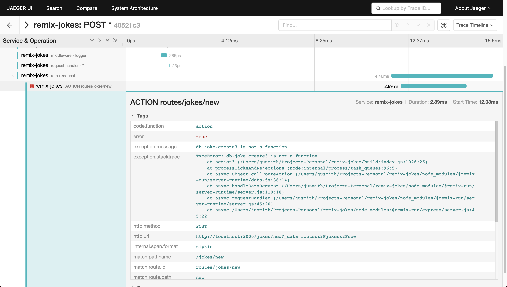

# Overview

This is a fork of the [Remix Jokes Tutorial Repo](https://github.com/remix-run/remix-jokes) that adds OpenTelemetry tracing instrumentation to showcase the instrumentation plugins available in the [justindsmith/opentelemetry-instrumentations-js](https://github.com/justindsmith/opentelemetry-instrumentations-js) repository.

# Important Files

To add tracing instrumentation, a [tracing.js](./tracing.js) file was added to include the necessary instrumentation libraries. The calling of the remix cli was updated in [package.json](./package.json) to require the tracing script before booting the server to allow the instrumentation to properly patch the necessary dependencies. This approach should work for most node server deployments.

```
node -r ./tracing.js node_modules/.bin/remix dev
```

# Getting Started

Install dependencies:
```
npm install
```

Start [Jaeger](https://www.jaegertracing.io/) using docker (this will collect all the emitted information):
```
docker run -d --name jaeger \
  -e COLLECTOR_ZIPKIN_HOST_PORT=:9411 \
  -p 5775:5775/udp \
  -p 6831:6831/udp \
  -p 6832:6832/udp \
  -p 5778:5778 \
  -p 16686:16686 \
  -p 14250:14250 \
  -p 14268:14268 \
  -p 14269:14269 \
  -p 9411:9411 \
  jaegertracing/all-in-one:1.30
```

Start the server in dev mode:
```
npm run dev
```

Load the Remix Jokes UI and click around:
<br/>http://localhost:3000

Access Jaeger UI to view the emitted traces:
<br/>http://localhost:16686

# What You'll Get

Loading a page:


Creating a new joke (successfully):


Creating a new joke (unsuccessfully):


